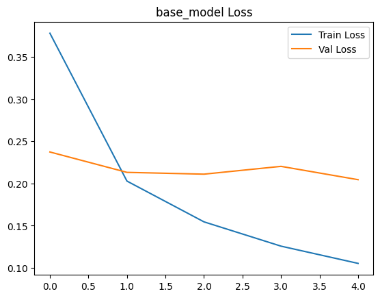
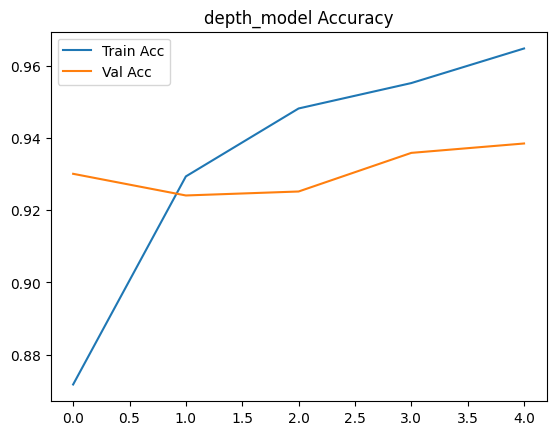
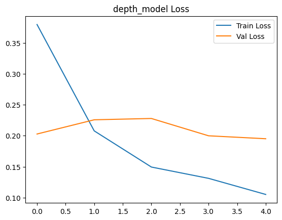
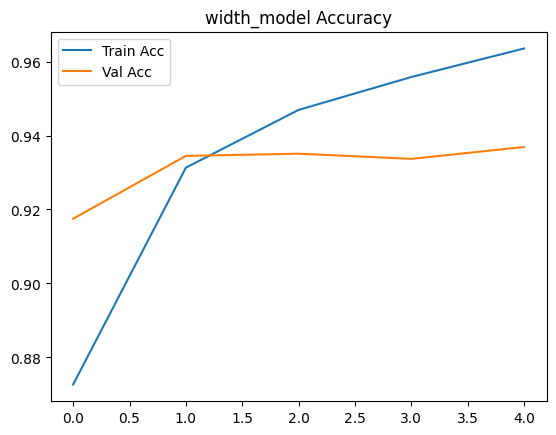
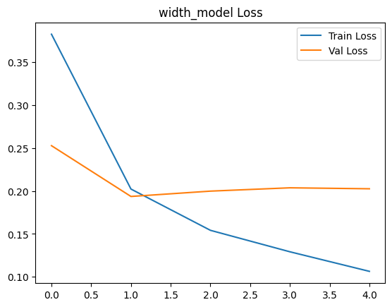
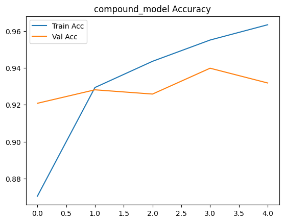
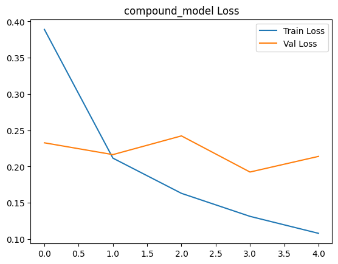

# 📄 Paper Summary: EfficientNet

**Title**: EfficientNet: Rethinking Model Scaling for Convolutional Neural Networks  
**Link**: [https://arxiv.org/abs/1905.11946](https://arxiv.org/abs/1905.11946)  
**Authors**: Mingxing Tan, Quoc V. Le  
**Published by**: Google AI (ICML 2019)  

---

## ✅ Day 0 – Why I Chose This Paper

### 📌 Background & Motivation

After reading **MobileNetV2**, I was curious about what came next in the evolution of efficient CNNs.  
MobileNetV2 introduced **inverted residual blocks** and showed how to design lightweight architectures for mobile and edge devices.

While searching for the next step in the family tree, I discovered **EfficientNet**, which:

- Builds directly on MobileNetV2’s design principles  
- Proposes a novel **compound scaling** strategy to scale depth, width, and resolution **together**  
- Uses **Neural Architecture Search (NAS)** to discover a strong baseline model (EfficientNet-B0)  
- Achieves **SOTA accuracy** with significantly fewer FLOPs and parameters

This made it the **perfect follow-up paper** to dive into.

---

## ✅ Day 1 – Abstract, Introduction & Motivation

### 📌 Abstract Summary

EfficientNet introduces a new family of CNN models that balance accuracy and efficiency by proposing a **compound scaling method**.  
Instead of scaling network depth, width, or resolution arbitrarily, it scales all three dimensions **uniformly** based on a fixed set of coefficients.  
The base model EfficientNet-B0 is discovered using **Neural Architecture Search**, and larger variants (B1–B7) are derived via compound scaling.

EfficientNet models achieve **state-of-the-art accuracy** with **significantly fewer parameters and FLOPs**, making them ideal for both cloud and edge deployment.

---

### 📌 Introduction Insights

- Prior CNN models improved accuracy by simply **making networks deeper or wider**, which leads to inefficient computation.  
- EfficientNet solves this by introducing a **principled method** to scale all model dimensions together.  
- Compound scaling maintains a balance across depth, width, and resolution, leading to better accuracy and efficiency.  
- EfficientNet achieves top-1 ImageNet accuracy of **84.4%** with **8.4× fewer FLOPs** and **6.1× fewer parameters** than previous models like GPipe and ResNet.

---

### 📌 Problem Statement

Most existing scaling methods focus on only **one** dimension:

- Increase **depth** → may suffer from vanishing gradients  
- Increase **width** → higher memory usage  
- Increase **resolution** → higher computation cost  

There is no systematic rule for scaling them **together**.  
EfficientNet introduces a **compound coefficient φ** and a method to uniformly scale all three using constants (α, β, γ).

---

### 📌 Core Design Principles

1. **Search for a good baseline (EfficientNet-B0)** using Neural Architecture Search  
2. **Scale it up** with fixed scaling constants:  

$$
\text{depth} \propto \alpha^\phi,\quad 
\text{width} \propto \beta^\phi,\quad 
\text{resolution} \propto \gamma^\phi
$$

3. Maintain resource constraint:

$$
\alpha \cdot \beta^2 \cdot \gamma^2 \approx 2 \quad \text{(to double FLOPs per } \phi \text{)}
$$

This leads to a family of EfficientNet-B1 to B7.

---

### 📌 3-Line Summary

- EfficientNet proposes a **compound scaling method** that balances depth, width, and resolution.  
- It starts from a **NAS-searched baseline (B0)** and scales uniformly for larger variants.  
- The result is a set of models that are both **accurate and lightweight**, outperforming deeper/wider networks with fewer resources.

---

### 📌 Unfamiliar Terms

- **Compound scaling**: A method to jointly scale multiple model dimensions with a single coefficient φ.  
- **Neural Architecture Search (NAS)**: An automated way to design neural networks optimized for accuracy and efficiency.  
- **FLOPs**: Floating Point Operations — a measure of computational cost.

---

## ✅ TL;DR

EfficientNet presents a **scaling framework** that delivers high accuracy with low cost.  
By searching a compact baseline model and applying **balanced scaling**, it achieves **SOTA performance** with far fewer parameters and FLOPs than previous CNN architectures.  
Its ideas are simple yet powerful, and widely used in modern vision models and real-world deployments.

---

---

## ✅ Day 2 – Motivation Experiments & Compound Scaling

### 📌 Motivation by Experiments (Section 3)

EfficientNet experimentally evaluates how scaling only one dimension—depth, width, or resolution—affects model performance. The results clearly show **diminishing returns** when scaling is unbalanced.

#### 📊 Summary of Figure 2

| Subfigure | Experiment            | Summary |
|-----------|------------------------|---------|
| (a)       | Baseline               | EfficientNet-B0 from NAS |
| (b)       | Width only             | Early gains, but performance plateaus quickly |
| (c)       | Depth only             | Gradual improvement, but saturates after a point |
| (d)       | Resolution only        | Accuracy drops at very high input sizes due to noise/overfitting |

#### ⚠️ Key Insights

- **Depth**: Vanishing gradients, optimization challenges  
- **Width**: Better for fine-grained features, but lacks high-level semantics when overly wide  
- **Resolution**: Too large input → noise and computational overload

> ❗ Each single-axis scaling shows limited benefit → efficient scaling needs all three dimensions to grow **together**.

---

### 📌 Compound Scaling Formula (Section 4.1)

EfficientNet proposes **compound scaling**, a principled way to scale **depth, width, and resolution simultaneously**.

#### 🧮 Formula

$$
\text{depth} \propto \alpha^{\phi}, \quad 
\text{width} \propto \beta^{\phi}, \quad 
\text{resolution} \propto \gamma^{\phi}
$$

- **α**: depth factor  
- **β**: width factor  
- **γ**: resolution factor  
- **φ (phi)**: user-defined compound coefficient → how much to scale the model

#### 🔒 FLOPs Constraint

$$
\alpha \cdot \beta^2 \cdot \gamma^2 \approx 2
$$

- Ensures FLOPs double with each step φ → **computational budget grows steadily**
- β and γ are squared because width and resolution each affect FLOPs **quadratically**

#### 🧠 What φ Means

- φ = 0 → base model (EfficientNet-B0)  
- φ = 1 → depth ×α, width ×β, resolution ×γ  
- φ = 2 → depth ×α², etc.  
→ FLOPs grow roughly as: $$\text{FLOPs} \approx 2^{\phi}$$

---

### 💬 Quick Recap Q&A

- **Q: Why not just scale depth?**  
  A: Gradient vanishing, slow improvements

- **Q: Why not just scale resolution?**  
  A: Too large → noise, memory issues

- **Q: Why use α, β, γ?**  
  A: To balance scaling across model dimensions with fixed resources

---

## ✅ Day 3 – EfficientNet-B0 Architecture & Scaling Coefficients

### 📌 How EfficientNet-B0 Was Designed

EfficientNet-B0 was not manually designed — it was discovered using **Neural Architecture Search (NAS)**.  
The search was conducted in the **MnasNet search space**, but with a larger target FLOPs (400M).  
The optimization objective balances accuracy and efficiency:

$$
\text{Objective} = \text{ACC}(M) \cdot \left( \frac{\text{FLOPs}(M)}{T} \right)^w
$$

- \( T = 400M \): FLOPs target  
- \( w = -0.07 \): trade-off weight between accuracy and resource usage

---

### ⚙️ Architecture Details: MBConv + SE

EfficientNet-B0 primarily uses **MBConv blocks** (Mobile Inverted Bottlenecks) with **Squeeze-and-Excitation (SE)** modules for better feature calibration.

#### 🔧 Core Elements:
- **MBConv1** used only in early stage (expansion ratio = 1)
- **MBConv6** used elsewhere (expansion ratio = 6)
- **SE modules** improve channel-wise feature importance
- **Skip connections** applied when:
  - Stride = 1  
  - Input and output shapes match

This design keeps the model lightweight yet expressive.

---

### 📐 Compound Coefficients: α, β, γ

After designing B0, the authors use a **grid search** to find the best scaling coefficients for:

- \( \alpha = 1.2 \): depth  
- \( \beta = 1.1 \): width  
- \( \gamma = 1.15 \): resolution

Subject to the constraint:

$$
\alpha \cdot \beta^2 \cdot \gamma^2 \approx 2
$$

This ensures that **each increment in φ roughly doubles FLOPs**.  
Why squared? Because both width and resolution affect computation quadratically.

---

### 💡 Why Use Small-Model Search?

Searching (α, β, γ) on large models is **expensive**.  
So the authors find them using **EfficientNet-B0**, and **reuse them** for all other models (B1–B7).  
This keeps the search cost low, while allowing consistent and scalable expansion.

---

### 📌 Recap Takeaways

- EfficientNet-B0 is a compact, NAS-optimized architecture using MBConv and SE blocks  
- Compound scaling applies α, β, γ to scale all dimensions **uniformly**  
- The constraint \( \alpha \cdot \beta^2 \cdot \gamma^2 \approx 2 \) ensures **predictable FLOPs growth**  
- Coefficients are found once on B0, and reused for larger EfficientNet variants

---

### 🧠 Personal Reflection

What stood out today was how **elegant and scalable** the design is.  
Instead of manually tuning every model, EfficientNet finds a good baseline and then grows it using **simple math**.  
This makes it both **theoretically sound and practically efficient** — a rare combo in model design.

---

## ✅ Day 4 – Scaling Results (Section 4.3 & Table 2)

### 📌 Purpose of This Section

The authors demonstrate that their **compound scaling method** consistently outperforms other popular models across a wide range of sizes — from small mobile models to large server-grade models.  
This section validates the **effectiveness and generality** of EfficientNet across different FLOPs budgets.

---

### 📊 Table 2 Summary: ImageNet Top-1 Accuracy vs. FLOPs

| Model             | Top-1 Accuracy | Params | FLOPs | Notes |
|------------------|----------------|--------|-------|-------|
| ResNet-50        | 76.3%          | 25.6M  | 4.1B  | Strong baseline |
| ResNet-101       | 77.4%          | 44.5M  | 7.8B  | Larger ResNet |
| GPipe-1          | 84.3%          | 556M   | 591B  | Extremely large |
| EfficientNet-B0  | 77.1%          | 5.3M   | 0.39B | Base model |
| EfficientNet-B4  | 83.0%          | 19M    | 4.2B  | Comparable FLOPs to ResNet-50, but much higher accuracy |
| EfficientNet-B7  | **84.4%**      | 66M    | 37B   | SOTA performance |

---

### 📈 Key Takeaways from Scaling Results

- **EfficientNet consistently dominates** in both accuracy and FLOPs/params across all scales.
- Even **EfficientNet-B4**, with only 4.2B FLOPs, outperforms **ResNet-152** (60.2M params, 11.5B FLOPs).
- The **returns start to diminish** around B6–B7, meaning accuracy gain becomes smaller despite higher computational cost.
- This confirms the **efficacy of compound scaling** over manual or naive scaling.

---

### 🔍 At What Point Do Returns Diminish?

- **Diminishing returns** refers to the point where adding more FLOPs or parameters gives **less improvement in accuracy**.
- In EfficientNet, this trend starts appearing **beyond B6**, where the **cost rises faster than the gain**.
- However, the models still remain **more efficient** than existing baselines even at large scales.

---

### 🧠 Personal Reflection

Today’s section showed that **elegant scaling isn't just theoretical** — it leads to real-world performance gains.  
It's impressive how EfficientNet can scale up from **tiny mobile models** to **giant server models** using just one method.  
I especially liked how the authors used a **systematic comparison** with popular baselines to prove the generality of their approach.

## ✅ Day 5 – Conclusion & Personal Takeaway

### 📌 Conclusion Summary

EfficientNet is fundamentally a paper about **scaling methods** for CNNs.  
Traditional approaches scaled only one dimension at a time — depth, width, or input resolution — but EfficientNet proposes a **compound scaling** method that scales all three simultaneously.  
This approach proves to be **highly efficient** in terms of both **accuracy and computational cost (FLOPs)**.

---

### 📌 Core Contribution

- Introduces a **systematic, unified scaling method** instead of arbitrary, single-dimension scaling  
- Achieves **state-of-the-art accuracy** with significantly fewer parameters and FLOPs  
- Demonstrates scalability from small mobile models to large server-level models using the same principle  
- Validates compound scaling with both **theoretical constraint** and **empirical results**

---

### 🧠 Personal Reflection

For me, the most meaningful part of EfficientNet is its **practicality under limited resources**.  
As someone who studies computer vision independently, I often face constraints in computing power.  
In such situations, achieving high accuracy requires **efficiency, not brute force**.  

EfficientNet offers a well-structured way to get better performance without overloading my hardware —  
so I expect to **use this model frequently in future projects**.

--- 

## ✅ Day 6 – My Reproduction Results

### 📌 Objective

To verify the effectiveness of **compound scaling** proposed in the EfficientNet paper, I conducted a comparative experiment using four models:

- `base_model`: EfficientNet-B0 at resolution 224  
- `depth_model`: Depth scaling only, resolution 256  
- `width_model`: Width scaling only, resolution 256  
- `compound_model`: Depth + width + resolution scaling, resolution 300  

All models were trained for **5 epochs** with the same number of parameters (~4M), using identical training configurations (optimizer, loss, augmentation).

---

### ⚙️ Configuration Summary

| Model Type       | Resolution | FLOPs (MMac) | Params (M) |
|------------------|------------|--------------|------------|
| Base (B0)        | 224        | 408.93       | 4.02       |
| Depth-only       | 256        | 533.91       | 4.02       |
| Width-only       | 256        | 578.40       | 4.02       |
| Compound Scaling | 300        | 838.07       | 4.02       |

---

### 📈 Validation Accuracy by Epoch

| Epoch | Base (%) | Depth (%) | Width (%) | Compound (%) |
|-------|----------|-----------|-----------|--------------|
| 1     | 91.89    | 93.01     | 91.75     | 92.08        |
| 2     | 92.94    | 92.41     | 93.45     | 92.81        |
| 3     | 93.39    | 92.52     | 93.51     | 92.58        |
| 4     | 93.16    | 93.59     | 93.37     | **93.98**    |
| 5     | **93.82**| **93.85** | 93.69     | 93.18        |

---

### 🧪 Best Performance Summary

| Model         | Best Val Accuracy | Lowest Val Loss |
|---------------|-------------------|------------------|
| Base (B0)     | 93.82%            | 0.2045           |
| Depth-only    | 93.85%            | **0.1951**       |
| Width-only    | 93.69%            | 0.1936           |
| Compound      | **93.98%**        | **0.1924**       |

---

### 🧠 Analysis & Takeaways

- **Compound scaling** model achieved the **highest accuracy** and **lowest validation loss**.
- **Depth-only** scaling also yielded efficient performance, offering a good trade-off between FLOPs and accuracy.
- **Width-only** scaling showed decent performance, though some signs of overfitting appeared.
- The **Base model** (EfficientNet-B0) still performed competitively and converged quickly.

> 📌 These results confirm that **balanced compound scaling** is more effective than scaling along a single axis, aligning well with the conclusions of the original paper.

---

### 📷 Visualizations

Loss and Accuracy plots for each model:

### 📷 Training Curves

**Base Model Accuracy**  

**Base Model Loss**  

**Depth-only Accuracy**  

**Depth-only Loss**  

**Width-only Accuracy**  

**Width-only Loss**  

**Compound Model Accuracy**  

**Compound Model Loss**  

---

### 💡 Reflection

> 💡 Note: While the compound model achieved the best performance, the overall differences between models on CIFAR-10 were relatively small.  
> This suggests that **compound scaling becomes more important as the task complexity increases**.  
> On simple datasets like CIFAR-10, even base or shallow models can perform well, masking the real benefits of advanced scaling strategies.  
> Future experiments on more complex datasets (e.g., CIFAR-100, TinyImageNet, Food-101) could better highlight the advantages of compound scaling.

